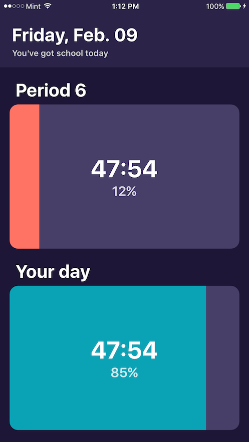
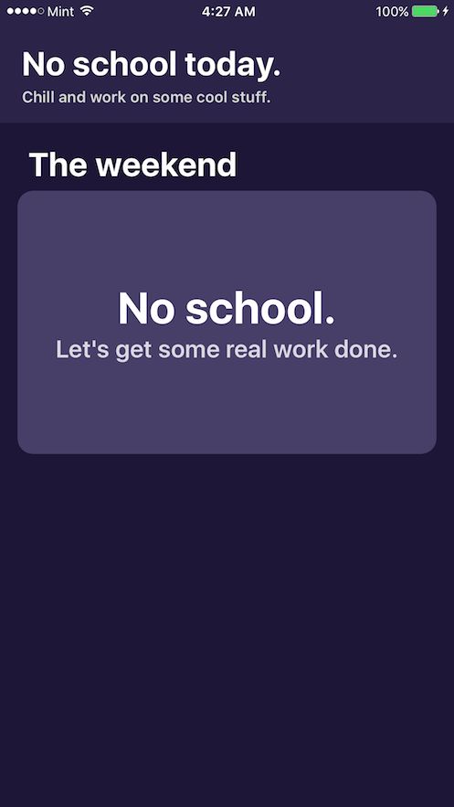

 

# Until iOS

Until is an iOS app that tells you how exactly much time is left until the next class period ends. It also tells you the exact percentage of the day you've completed along with how long you need to wait until you can go home.

I find myself looking at the school schedule way too often to find out how much time I have left. It's also a question that I hear asked all the time during class, so I decided to Swiftly (pun intended) build this app in a day.

 

## Usage
You can customize your schedule easily by downloading the Xcode project and editing the agenda.json file in the `Until/Until/Resource Files` directory of this repository. Each day is contained within an array, and you can edit the text before the `@` character for the title, and the text after for the time. The format is in 24 hour time.

```
[
  "Before school@7:35",
  "Period 1@8:25",
  "Period 2@9:20",
  "Period 3@10:20",
  "Brunch@10:35",
  "Period 4@11:30",
  "Period 5@12:25",
  "Lunch@13:05",
  "Period 6@14:00",
  "Period 7@14:55"
]
```
It automatically recognizes that weekends are holidays and doesn't give you any schedule on those days.

## A few more screenshots






This is just a cool list of colors I used to dynamically animate the progression bar.